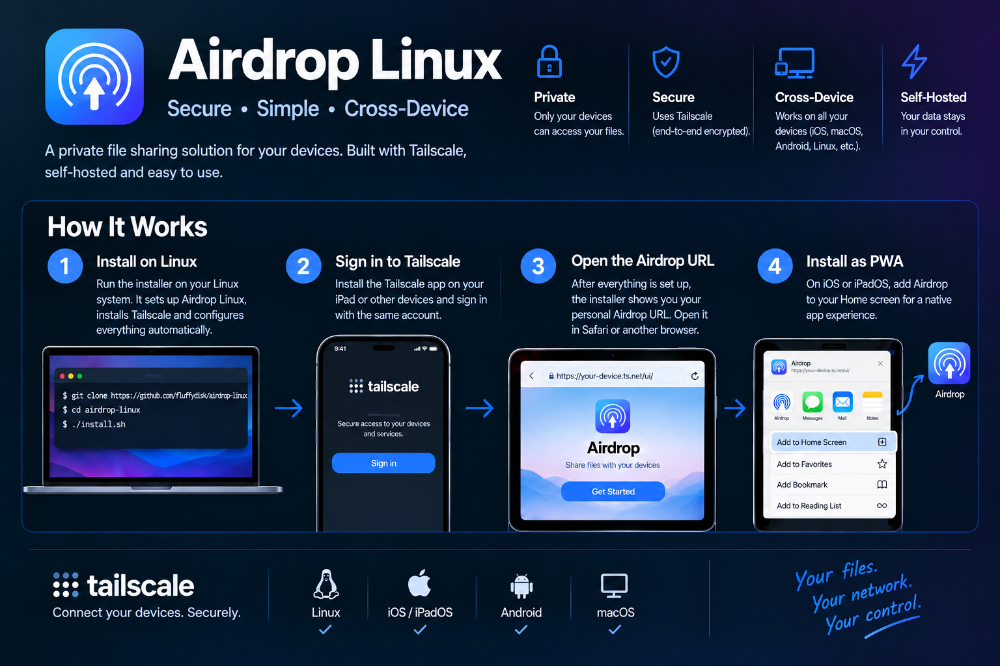

# Airdrop Linux

A self-hosted file and clipboard sharing system that runs over Tailscale. It is designed as a private alternative to AirDrop for sharing files and clipboard content between iPad, iPhone, Android, and Linux/desktop devices. It includes an iOS-inspired PWA interface, real Web Push notifications, and bidirectional clipboard synchronization.



## Architecture

- **[dufs](https://github.com/sigoden/dufs)** — lightweight HTTP file server for serving the shared files
- **Tailscale** — secure private networking between devices, with `tailscale serve` providing HTTPS termination
- **Node.js + Express + web-push** — small push server that sends real push notifications when new files arrive
- **Single-file PWA** (`ui/index.html`) — iOS-inspired interface with a Service Worker for push notifications and the Android Web Share Target API

## Quick start

```bash
git clone https://github.com/fluffydisk/airdrop-linux.git
cd airdrop-linux
./install.sh
```

The installer automatically:

- Detects your Linux distribution and installs missing dependencies (Node.js, dufs, clipboard utilities, and Tailscale)
- Creates `~/AirdropShare` and `~/airdrop-push` and copies the application files
- Installs the npm dependencies
- **Generates a fresh VAPID key pair for your installation** so users never inherit someone else's credentials
- Installs and starts the systemd services using your current user account when systemd is available
- Sets the installing user as the Tailscale Linux operator
- Authenticates the machine with Tailscale when needed (the installer pauses for the normal browser login)
- Configures Tailscale Serve automatically for the Airdrop file server (`/`) and push server (`/push`)
- Prints the exact Airdrop HTTPS URL to open on the user's other devices
- Installs terminal helpers (`airdrop`, `copy-clipboard`, `paste-clipboard`) in `~/.local/bin` and automatically detects Wayland vs. X11 for clipboard access

The only external step that may be required is enabling HTTPS certificates for your tailnet in the Tailscale admin console. Tailscale Serve requires HTTPS certificates; once they are enabled, re-running `./install.sh` completes the Serve configuration automatically.

### Requirements

- A Linux distribution with systemd for automatic service management
- A [Tailscale](https://tailscale.com/) account
- `curl` and `sudo` access
- Tailscale HTTPS certificates enabled for the tailnet when using automatic Serve setup

The included Docker test suite covers Ubuntu, Debian, Fedora, Rocky Linux, openSUSE Tumbleweed, Arch Linux, Alpine Linux, and Void Linux. Docker containers do not provide a normal desktop session or a full systemd environment, so clipboard integration and real service startup are not completely exercised by the container tests.

## Manual installation

You can also install Airdrop manually instead of using `install.sh`.

<details>
<summary>Show the manual steps</summary>

### 1. Place the application files

```bash
mkdir -p ~/AirdropShare/ui
cp ui/* ~/AirdropShare/ui/
mkdir -p ~/airdrop-push
cp push-server.js package.json .env.example ~/airdrop-push/
cd ~/airdrop-push && npm install
```

### 2. Generate VAPID keys

```bash
npx web-push generate-vapid-keys
```

Copy `.env.example` to `.env` and put the generated keys into it:

```bash
cp .env.example .env
# Edit .env and set VAPID_PUBLIC_KEY and VAPID_PRIVATE_KEY
```

### 3. Tailscale and HTTPS

```bash
sudo tailscale up
sudo tailscale set --hostname=<your-fixed-name>
sudo tailscale serve --bg --set-path / http://localhost:5000
sudo tailscale serve --bg --set-path /push http://127.0.0.1:6001
```

> **Important:** Set a stable system hostname as well. Otherwise the Tailscale device name may change after a reboot:
> ```bash
> sudo hostnamectl set-hostname <your-name>
> ```

### 4. systemd services

Replace `<USER>` in `systemd/*.service.example` with your Linux username and copy the files to `/etc/systemd/system/`:

```bash
sudo cp systemd/airdropshare.service.example /etc/systemd/system/airdropshare.service
sudo cp systemd/airdrop-push.service.example /etc/systemd/system/airdrop-push.service
# Replace <USER> with your username in both files
sudo systemctl daemon-reload
sudo systemctl enable --now airdropshare.service
sudo systemctl enable --now airdrop-push.service
```

### 5. Terminal helpers

Append `bashrc-snippets.sh` to the end of `~/.bashrc`:

```bash
cat bashrc-snippets.sh >> ~/.bashrc
source ~/.bashrc
```

For Wayland, install `wl-clipboard`. For X11, use the `xclip` or `xsel` commands shown in the installer-generated helper scripts.

</details>

## Device setup

1. Install Tailscale on each device and sign in to the same tailnet.
2. Open `https://<hostname>.<tailnet-name>.ts.net/ui/`.
3. Add the PWA to the home screen on iOS, or install the web app on Android/Chrome.
4. Enable notifications when prompted.

## Usage

```bash
airdrop file.pdf            # Copy a file into the shared folder; add (1), (2), ... on name conflicts
paste-clipboard              # Send the local Linux clipboard to the server
copy-clipboard               # Copy the server clipboard into the local Linux clipboard
```

When a new file arrives on one device, all other subscribed devices receive a push notification. Tapping the notification opens the file prompt with **Accept** and **Reject** actions.

On Android, files can also be sent directly to Airdrop from another app's system **Share** menu through the Web Share Target API.

## Troubleshooting

- **Push notifications do not arrive:** Check that `VAPID_PUBLIC_KEY` and `VAPID_PRIVATE_KEY` are set in `~/airdrop-push/.env`, then monitor the service with `sudo journalctl -u airdrop-push.service -f`.
- **`/ui/` shows a file listing instead of the app:** Make sure dufs is started with the `--render-try-index` flag (`systemctl cat airdropshare.service`).
- **The hostname changes after reboot:** Set a stable system hostname with `sudo hostnamectl set-hostname <name>`, then run `sudo tailscale set --hostname=<name>`.
- **Clipboard synchronization does not work:** Check `echo $XDG_SESSION_TYPE` and make sure the appropriate clipboard utility (`wl-clipboard`, `xclip`, or `xsel`) is installed.

## Security

`VAPID_PRIVATE_KEY` controls access to the Web Push notification identity. Never share it or commit it to a public repository. `install.sh` generates a new key pair for every fresh installation, so cloning this repository does not reuse the maintainer's credentials. The generated `.env` file is already excluded by `.gitignore`.

Because the application is exposed through `tailscale serve`, the service is intended to remain private to your tailnet rather than being publicly reachable from the Internet.

## Roadmap

- [ ] Desktop GUI (system tray application with status indicator and drag-and-drop)
- [ ] iOS Shortcuts template for Share Sheet integration
- [ ] Multi-file ZIP support

## Contributing

Pull requests and issues are welcome.

## License

MIT
